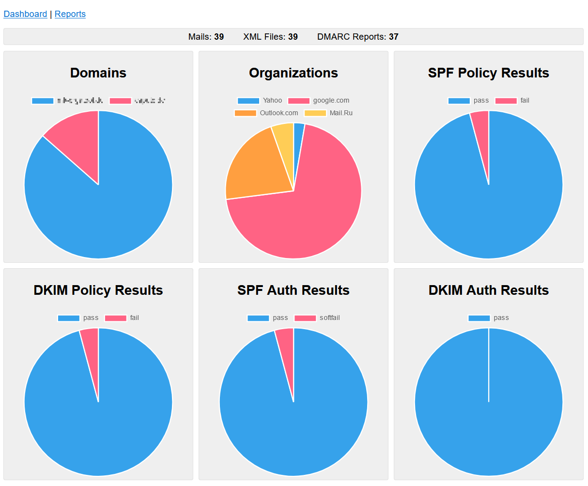

# DMARC Report Viewer

A lightweight selfhosted standalone [DMARC](https://en.wikipedia.org/wiki/DMARC#Aggregate_reports) and [SMTP TLS](https://en.wikipedia.org/wiki/Simple_Mail_Transfer_Protocol#SMTP_TLS_Reporting) report viewer.
Ideal for smaller selfhosted mailservers to browse, visualize and analyze the reports.

The application is a single fully statically linked executable written in Rust.
It combines a report parser with an IMAP client and an HTTP server.
The embedded HTTP server offers a web UI for easy access and filtering of the reports.

You can run the precompiled executable directly on any Linux, Windows or MacOS system.
Alternatively, you can use the tiny 10 MB Docker image to deploy the application.
It is also easy to [build the application](#build-from-source) directly from source.

You can find more screenshots [here](screenshots/screenshots.md).

## Features
- [x] Lightweight Docker image for easy deployment
- [x] Prebuilt binaries and Docker images
- [x] Runs out of the box on a Raspberry Pi
- [x] Secure IMAP client (TLS & STARTTLS)
- [x] Robust parsing of XML DMARC reports
- [x] Robust parsing of JSON SMTP TLS reports
- [x] Embedded HTTP server for Web UI
- [x] Responsive Web UI that works also on small screens
- [x] Automatic fetching of reports from IMAP inbox
- [x] Updates are scheduled via simple update interval or cron expression
- [x] Automatic HTTPS via ACME/Let's Encrypt
- [x] Basic Auth password protection for HTTP server
- [x] Easy configuration via command line arguments or ENV variables
- [x] Configurable maximum size of mails (to skip oversized mails)
- [x] Summary with charts for domains, organizations and passed/failed checks
- [x] Filter charts summary by domain or time span
- [x] Viewing filtered lists of reports
- [x] Viewing of individual reports
- [x] Export reports as XML or JSON documents
- [x] List all mails in the IMAP inbox
- [x] Viewing of individual mail metadata with a list of extracted reports
- [x] Show parsing errors for reports
- [x] Lookup of DNS, location, whois and other source IP properties

## Changelog
Read the [CHANGELOG.md](CHANGELOG.md) file for a list of all released versions and their corresponding changes.

## Run with Docker
The latest versions are automatically published as Docker images in the GitHub container registry.
You can download the latest release using the command `sudo docker pull ghcr.io/cry-inc/dmarc-report-viewer`.

### Available Docker Tags
The following tags are available (aside from the versioned tag for all individual releases):
* `latest` (Latest stable release)
* `develop` (Last development build from master branch)

## Configuration
List all available configuration parameters with the corresponding environment variables and default values by running this command:
`sudo docker run --rm ghcr.io/cry-inc/dmarc-report-viewer ./dmarc-report-viewer --help`.

You can configure the application with command line arguments or environment variables.
For the Docker use case, environment variables are recommended.
Do not forget to forward the port for the HTTP server!
By default the HTTP server will use port 8080.

Here is an example: 

    sudo docker run --rm \
      -e IMAP_HOST=imap.mymailserver.com \
      -e IMAP_USER=dmarc@mymailserver.com \
      -e IMAP_PASSWORD=mysecurepassword \
      -e HTTP_SERVER_USER=webui-user \
      -e HTTP_SERVER_PASSWORD=webui-password \
      -p 8080:8080 \
      ghcr.io/cry-inc/dmarc-report-viewer

### Application Data
This application does not store any reports in a database or in any other kind of file.
All data is kept in memory and retrieved each time fresh from the configured IMAP account.
The only exception is the certificate cache folder when using Let's Encrypt,
this folder should be persisted and saved between application restarts.

### IMAP Folders
You can define separate IMAP folders for fetching DMARC and TLS reports.
By default one single `INBOX` is used to look for both kind of reports.
If you specify at least one of the dedicated folders, the default folder will be disabled.
Please note that fetching reports from different IMAP accounts is currently not supported.
You might have to setup some forwarding if you are receiving them on separate accounts.

### IMAP with STARTTLS
By default the IMAP client will attempt to use a TLS encrypted connection using port 993.
For STARTTLS set the ENV variables `IMAP_STARTTLS=TRUE` and `IMAP_PORT=143`.

### HTTPS for UI
By default, the application will start an unencrypted and unsecure HTTP server.
It is *strongly* recommended use the automatic HTTPS feature that will automatically fetch and renew a certificate from Let's Encrypt.
This feature uses the TLS-ALPN-01 challenge, which uses the HTTPS port 443 also for the challenge. No port 80 required!
Alternatively, you can use an separate HTTPS reverse proxy like [Caddy](https://caddyserver.com/) to secure the application.

To use the automatic HTTPS feature you need to make sure that the public port exposed to the internet is 443.
You should also persist the certificate caching directory on your host file system:

    sudo docker run --rm \
      -e IMAP_HOST=imap.mymailserver.com \
      -e IMAP_USER=dmarc@mymailserver.com \
      -e IMAP_PASSWORD=mysecurepassword \
      -e HTTP_SERVER_PORT=8443 \
      -e HTTP_SERVER_USER=webui-user \
      -e HTTP_SERVER_PASSWORD=webui-password \
      -e HTTPS_AUTO_CERT=true \
      -e HTTPS_AUTO_CERT_CACHE=/certs \
      -e HTTPS_AUTO_CERT_MAIL=admin@mymailserver.com \
      -e HTTPS_AUTO_CERT_DOMAIN=dmarc.mymailserver.com \
      -v /host/cert/folder:/certs \
      -p 443:8443 \
      ghcr.io/cry-inc/dmarc-report-viewer

### IPv6 Support
By default the HTTP server will bind to any IPv4 address of the machine.
This is because the default bind setting is `0.0.0.0`.
You can use the configuration option `--http-server-binding [::]` or ENV variable `HTTP_SERVER_BINDING=[::]` for IPv6.
Note that on Linux this will bind to both, IPv4 and IPv6 by default.

## Build from Source
1. Install Rust toolchain (see https://rustup.rs/)
2. Check out this repository (or download and extract the ZIP file)
3. Run the command `cargo build --release` in the folder with this README file
4. Find the compiled executable in the folder `target/release`
5. Use the help argument to list all possible configuration parameters: `dmarc-report-viewer --help`

### Docker Builds (Linux only)
The Dockerfile works for `amd64` and `arm64` architectures.
1. Install Docker
2. Check out this repository (or download and extract the ZIP file)
3. Run the command `sudo docker build . --pull --tag dmarc-report-viewer` in the folder with this README file
4. You should now be able to see the new Docker image using the command `sudo docker images`

## Acknowledgments
- All the Rust dependencies in [Cargo.toml](Cargo.toml) that make this application possible!
- [Charts.js](https://github.com/chartjs/Chart.js) and [Lit](https://lit.dev/) as embedded as JavaScript libraries for the UI.
- [@bbustin](https://github.com/bbustin) for his [dmarc_aggregate_parser](https://github.com/bbustin/dmarc_aggregate_parser) that was used as starting point for the DMARC report parser.
- [@marvinruder](https://github.com/marvinruder) implemented support for SMTP TLS reports!
