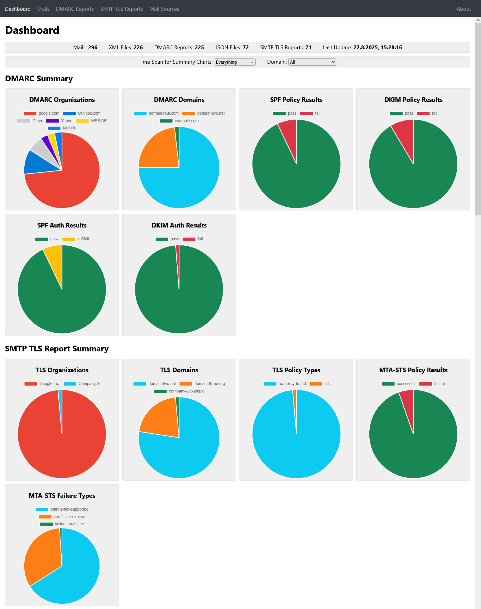

# DMARC Report Viewer

A lightweight selfhosted standalone DMARC report viewer that automatically fetches input data periodically from an IMAP mailbox.

Ideal for smaller selfhosted mailservers.
The application is a single fully statically linked executable written in Rust.
It combines a DMARC report parser with an IMAP client and an HTTP server.
The HTTP server serves a web UI for easy access and filtering of the reports.
You can run the executable directly on any Linux, Windows or MacOS system.
Alternatively, you can use the tiny 10 MB Docker image to deploy the application.

## Features
- [x] Lightweight Docker image for easy deployment
- [x] Secure IMAP client (TLS & STARTTLS)
- [x] Automatic fetching of reports from IMAP inbox
- [x] Robust parsing of XML DMARC reports
- [x] Embedded HTTP server for web UI
- [x] Automatic HTTPS via ACME/Let's Encrypt
- [x] Basic Auth password protection for HTTP server
- [x] Easy configuration via command line arguments or ENV variables
- [x] Configurable maximum size of mails (to skip oversized documents)
- [x] Summary with charts for domains, organizations and passed/failed checks
- [x] Viewing filtered lists of reports
- [x] Viewing of individual DMARC reports
- [x] Export DMARC reports as XML or JSON documents
- [x] List all mails in the IMAP inbox
- [x] Viewing of individual mail metadata with a list of extracted reports
- [x] Show parsing errors for DMARC reports

## Run with Docker
The latest version is always published automatically as Docker image in the GitHub container registry.
You can download the image using the command `sudo docker pull ghcr.io/cry-inc/dmarc-report-viewer`.

List all available configuration parameters with the corresponding environment variables by running this command:
`sudo docker run --rm ghcr.io/cry-inc/dmarc-report-viewer ./dmarc-report-viewer --help`.

You can configure the application with command line arguments or environment variables.
For the Docker use case, environment variables are recommended.
Do not forget to forward the port for the HTTP server!

Here is an example: 

    sudo docker run --rm \
      -e IMAP_HOST=imap.mymailserver.com \
      -e IMAP_USER=dmarc@mymailserver.com \
      -e IMAP_PASSWORD=mysecurepassword \
      -e HTTP_SERVER_PORT=8123 \
      -e HTTP_SERVER_USER=webui-user \
      -e HTTP_SERVER_PASSWORD=webui-password \
      -p 8123:8123 \
      ghcr.io/cry-inc/dmarc-report-viewer

### HTTPS
By default, the application will start an unencrypted and unsecure HTTP server.
It is *strongly* recommended use the automatic HTTPS feature that will automatically fetch and renew a certificate from Let's Encrypt.
This feature uses the TLS-ALPN-01 challenge, which uses the HTTPS port 443 also for the challenge. No port 80 required!
Alternatively, you can use an separate HTTPS reverse proxy like [Caddy](https://caddyserver.com/) to secure it.

To use the automatic HTTPS feature you need to make sure that the public port exposed to the internet is 443.
You should also persist the certificate caching directory on your host file system:

    sudo docker run --rm \
      -e IMAP_HOST=imap.mymailserver.com \
      -e IMAP_USER=dmarc@mymailserver.com \
      -e IMAP_PASSWORD=mysecurepassword \
      -e HTTP_SERVER_PORT=8443 \
      -e HTTP_SERVER_USER=webui-user \
      -e HTTP_SERVER_PASSWORD=webui-password \
      -e HTTPS_AUTO_CERT=true \
      -e HTTPS_AUTO_CERT_CACHE=/certs \
      -e HTTPS_AUTO_CERT_MAIL=admin@mymailserver.com \
      -e HTTPS_AUTO_CERT_DOMAIN=dmarc.mymailserver.com \
      -v /host/cert/folder:/certs \
      -p 443:8443 \
      ghcr.io/cry-inc/dmarc-report-viewer

## Build from Source
1. Install Rust (see https://rustup.rs/)
2. Check out this repository or download and extract the ZIP
3. Run the command `cargo build --release` in the folder with this README file
4. Find the compiled executable in the folder `target/release`
5. Use the help argument to list all possible configuration parameters: `dmarc-report-viewer --help`

### Docker Builds (Linux only)
Use the command `docker build . --pull --tag dmarc-report-viewer` to build the tiny Docker image.

## Acknowledgments
- https://github.com/bbustin/dmarc_aggregate_parser was used as foundation for the slightly modified DMARC report parser
- [Charts.js](https://github.com/chartjs/Chart.js) and [Lit](https://lit.dev/) as embedded as JavaScript libraries for the UI
- All the other Rust dependencies in [Cargo.toml](Cargo.toml) that make this application possible!
